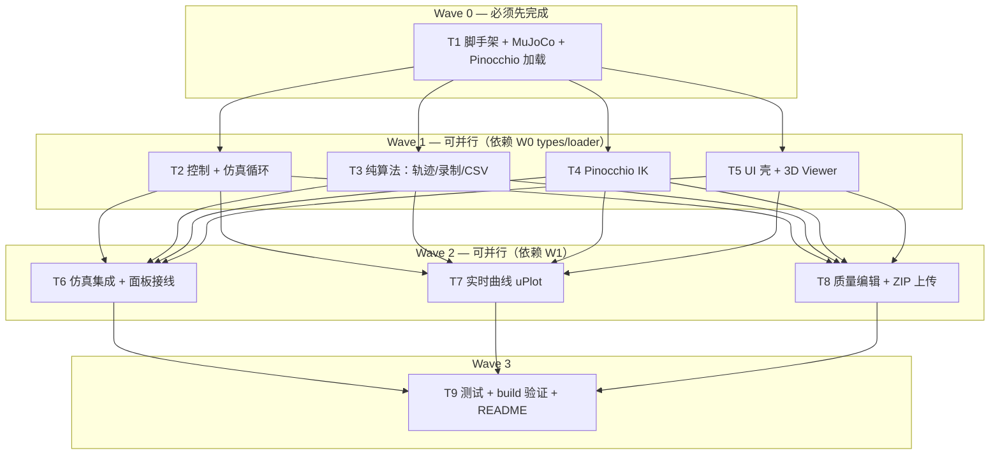

# Web 版任务分工与并行计划

> 主 agent 职责：**代码评审、集成冲突解决、验收勾选**（不直接写实现代码）  
> 规格来源：`WEB_IMPLEMENTATION_PLAN.md`  
> 归档代码 `_archive/legacy-python/` **禁止引用**

---

## 依赖关系总览

---

## 文件所有权（避免并行冲突）

| 任务 | 独占路径 | 禁止修改 |
|------|----------|----------|
| T1 | `web/package.json`, `vite.config.ts`, `tsconfig*`, `index.html`, `public/`, `src/types/`, `src/mujoco/`, `src/pinocchio/loader.ts`, `src/pinocchio/joint-map.ts`, `src/main.tsx`（仅 P0 入口） | `src/core/*`, `src/components/*` |
| T2 | `src/core/controller.ts`, `simulation.ts`, `planner.ts`, `robot-session.ts` | `mujoco/loader.ts` |
| T3 | `src/core/trajectory.ts`, `data-recorder.ts`, `src/export/csv-exporter.ts`, `src/core/*.test.ts`（算法类） | UI、mujoco |
| T4 | `src/pinocchio/ik.ts`, `src/core/inverse-kinematics.ts` | loader、joint-map |
| T5 | `src/App.tsx`, `src/components/**`, `src/stores/**`, `src/index.css` | `mujoco/*`, `core/simulation.ts` |
| T6 | 集成：`App.tsx` 接线、`src/hooks/useSimulation.ts` | 不重写各模块 internals |
| T7 | `src/components/charts/**` | — |
| T8 | `src/core/mass-editor.ts`, `src/utils/zip-extractor.ts`, 相关 panel | — |
| T9 | `web/vitest.config.ts`, 测试补齐, 根 `README.md` 运行说明 | 业务逻辑 |
| T10 | `src/App.tsx`, `src/index.css`, `src/components/ui/**`, `src/components/panels/*`（仅样式/markup）, `charts.css` | `core/*`, `hooks/useSimulation.ts` 逻辑 |

---

## Wave 0 — 已分发（后台）

### T1：脚手架 + MuJoCo/Pinocchio 加载层（阻塞项）

**验收**：
- [ ] `cd web && npm install && npm run dev` 可访问
- [ ] `test_arm.urdf` 从 `_archive/legacy-python/` 复制到 `public/robots/`
- [ ] VFS 加载 URDF，`mj_step` 1000 步无崩溃
- [ ] `mj_inverse` 返回有限力矩值
- [ ] pinocchio `buildPinocchioModel` 成功，JointMap 关节名与 MuJoCo 活动关节一致
- [ ] P0 页面显示 nq/nv/加载状态

---

## Wave 1 — 已完成（评审见 REVIEW_WAVE1.md）

| 任务 | 状态 | 备注 |
|------|------|------|
| T1 脚手架+MuJoCo | ✅ | build/dev 通过 |
| T2 控制+仿真 | ✅ | 4 冒烟测试；FK stub 待 Wave2 |
| T3 纯算法 | ✅ | 17 测试 |
| T4 IK | ✅ | 5 mock 测试 |
| T5 UI 壳 | ⚠️ | Wave 1 未独立交付，Wave 2 一并完成 |

---

## Wave 2 — 已完成（评审见 REVIEW_WAVE2.md）

| 任务 | 状态 | 备注 |
|------|------|------|
| T5+T6 UI + 仿真集成 | ✅ | `App.tsx`、`useSimulation`、FK 实装、面板接线 |
| T7 uPlot 实时曲线 | ✅ | `SimCharts` q/v/τ 指令虚线 vs 实际实线 |
| T8 ZIP + mass-editor | ✅ | `zip-extractor`、`MassEditorPanel` |

---

## Wave 3 — 已完成

| 任务 | 状态 | 备注 |
|------|------|------|
| T9 测试 + build + 文档 | ✅ | 30 测试、`npm run build` 通过；README / REVIEW_WAVE2 |

---

## Wave 4 — UI 改版（已完成）

| 任务 | 状态 | 备注 |
|------|------|------|
| T10 UI 视觉改版 | ✅ | workbench 布局、CSS 变量体系、CollapsibleSection 侧栏分组、暗色 uPlot、响应式抽屉 |

---

## 主 agent 评审检查项

每个子任务 PR/合并前检查：

1. **边界**：是否修改了非所有权文件
2. **双引擎**：控制回路是否仅用 `mj_inverse`（非 `pin.rnea`）
3. **JointMap**：跨引擎 q/v 是否按 name 映射
4. **内存**：MuJoCo Embind 对象是否 `.delete()`
5. **CSV**：列顺序与 `WEB_IMPLEMENTATION_PLAN.md` §5.8 一致
6. **构建**：`npm run build` 无 WASM 路径错误

---

## 子 agent 状态

| 任务 | 状态 |
|------|------|
| Wave 1 T1–T4 | ✅ 已评审 |
| Wave 1 T5 | ✅ 并入 Wave 2 交付 |
| Wave 2 T5+T6 | ✅ 已评审 |
| Wave 2 T7 | ✅ 已评审 |
| Wave 2 T8 | ✅ 已评审 |
| Wave 3 T9 | ✅ 收尾完成 |
| Wave 4 T10 | ✅ UI 视觉改版完成 |
